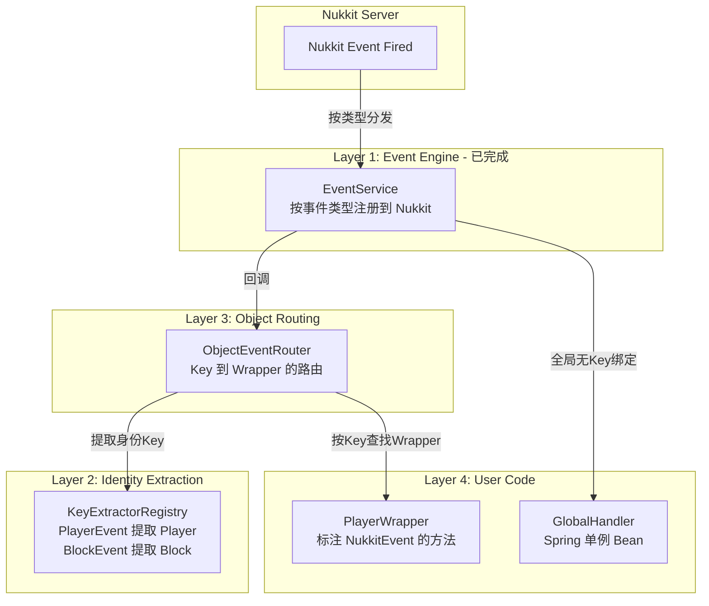

# OOP 事件路由框架设计方案

## 一、问题分析

用户的核心需求：**把 Nukkit 原生事件自动路由到对应的 OOP 包装类实例的具体方法上。**

```
玩家A触发 PlayerMoveEvent → 玩家A的 PlayerWrapper.onMove()
坐标B的方块触发 BlockBreakEvent → 坐标B的 BlockWrapper.onBreak()
```

Nukkit 事件携带的是**原生服务器对象**（`Player`、`Block`、`Position`），而用户需要路由到**自定义包装类实例**。
中间需要一个"身份提取 + 对象查找"的映射层。

## 二、整体架构（四层）



### 各层职责

| 层 | 组件 | 职责 | 状态 |
|----|------|------|------|
| L1 | `EventService` | 按事件类型注册到 Nukkit，过滤无关事件 | ✅ 已完成 |
| L2 | `KeyExtractorRegistry` | 从事件中提取身份Key（Player/Block/Position） | 🔲 待实现 |
| L3 | `ObjectEventRouter` | 按Key查找对应Wrapper，调用其处理方法 | 🔲 待实现 |
| L4 | `@NukkitEvent` 注解 + `EventBeanPostProcessor` | 声明式事件处理 + Spring自动注册 | 🔲 待实现 |

## 三、组件详细设计

### 3.1 `@NukkitEvent` 注解

标注在包装类的方法上，声明该方法处理哪种事件。

```java
@Target(ElementType.METHOD)
@Retention(RetentionPolicy.RUNTIME)
public @interface NukkitEvent {
    Class<? extends Event> value();           // 事件类型
    String condition() default "";            // SpEL 过滤条件（可选）
    EventPriority priority() default EventPriority.NORMAL;
}
```

### 3.2 `EventKeyExtractor` — 身份提取器

从事件对象中提取"身份Key"，用于路由到正确的包装类实例。

```java
@FunctionalInterface
public interface EventKeyExtractor<T extends Event> {
    Object extract(T event);
}
```

框架预置常见提取器：
- `PlayerEvent` → `event.getPlayer()`
- `BlockEvent` → `event.getBlock()`
- 用户可通过 `KeyExtractorRegistry.register()` 注册自定义提取器

### 3.3 `KeyExtractorRegistry` — 提取器注册表

```java
@Component
public class KeyExtractorRegistry {
    // 事件类型 → 提取器
    private final Map<Class<? extends Event>, EventKeyExtractor<?>> extractors = new ConcurrentHashMap<>();

    // 预置：PlayerEvent 子类自动提取 Player
    // 用户可注册自定义提取器
    public void register(Class<? extends Event> eventType, EventKeyExtractor<?> extractor);
    public Object extractKey(Event event);  // 返回 null 表示全局事件（无Key绑定）
}
```

### 3.4 `ObjectEventRouter` — 对象路由引擎（核心）

```java
@Component
public class ObjectEventRouter {
    // 事件类型 → (Key → 处理器列表)
    private final Map<Class<? extends Event>, ConcurrentHashMap<Object, List<AnnotatedHandler>>> routedHandlers;

    // 事件类型 → 全局处理器列表（无Key绑定，接收所有该类型事件）
    private final Map<Class<? extends Event>, List<AnnotatedHandler>> globalHandlers;

    // 注册一个包装类对象：扫描其 @NukkitEvent 方法，按Key绑定
    public void register(Object wrapper, Object key);

    // 注销一个包装类对象的所有事件绑定
    public void unregister(Object wrapper);

    // 注册一个全局处理器（Spring BeanPostProcessor 调用）
    public void registerGlobal(Object bean, Method method, NukkitEvent annotation);

    // 内部分发：由 EventService 回调
    void onEvent(Class<? extends Event> eventType, Event event);
}
```

**路由流程：**
1. 从 `KeyExtractorRegistry` 提取事件的Key
2. 如果Key不为null：在 `routedHandlers` 中按Key查找 → 只调用匹配的Wrapper
3. 同时调用 `globalHandlers` 中该事件类型的所有全局处理器
4. 如果有 SpEL condition：求值条件表达式，false则跳过

### 3.5 `EventBeanPostProcessor` — Spring 自动注册

扫描 Spring 容器中的单例 Bean，发现 `@NukkitEvent` 方法时自动注册为全局处理器。

```java
@Component
public class EventBeanPostProcessor implements BeanPostProcessor {
    // postProcessAfterInitialization: 扫描Bean的所有方法
    // 发现 @NukkitEvent → 调用 ObjectEventRouter.registerGlobal()
}
```

**注意：** `BeanPostProcessor` 只处理 Spring 管理的单例 Bean（全局处理器）。
动态创建的包装类实例（如每玩家一个 PlayerWrapper）需要手动调用 `router.register(wrapper, key)`。

## 四、目标 API（用户视角）

### 4.1 全局事件处理器（Spring 单例 Bean，自动注册）

```java
@Component
public class ChatLogService {
    @NukkitEvent(PlayerChatEvent.class)
    public void onChat(PlayerChatEvent event) {
        System.out.println(event.getPlayer().getName() + ": " + event.getMessage());
    }
}
// 无需任何手动注册代码，BeanPostProcessor 自动完成
```

### 4.2 OOP 包装类（动态实例，手动注册）

```java
public class PlayerWrapper {
    private final Player player;

    public PlayerWrapper(Player player) {
        this.player = player;
    }

    @NukkitEvent(PlayerMoveEvent.class)
    public void onMove(PlayerMoveEvent event) {
        player.sendMessage("你移动了！");
    }

    @NukkitEvent(value = PlayerInteractEvent.class,
                 condition = "#event.action.name() == 'RIGHT_CLICK_BLOCK'")
    public void onRightClickBlock(PlayerInteractEvent event) {
        player.sendMessage("你右键点击了方块！");
    }
}
```

```java
// 玩家上线时
PlayerWrapper wrapper = new PlayerWrapper(player);
eventRouter.register(wrapper, player);  // 扫描 @NukkitEvent，绑定到该 Player

// 玩家下线时
eventRouter.unregister(wrapper);  // 清除所有绑定
```

### 4.3 自定义粒度（如区域级）

```java
// 注册自定义提取器：从 BlockBreakEvent 提取区域ID
keyExtractorRegistry.register(BlockBreakEvent.class,
    event -> RegionManager.getRegionId(event.getBlock().getLocation()));

// 区域包装类
public class RegionWrapper {
    @NukkitEvent(BlockBreakEvent.class)
    public void onBreakInRegion(BlockBreakEvent event) {
        // 只有该区域的方块被破坏时才调用
    }
}
```

## 五、性能分析

| 场景 | 旧设计 catch-all | 新框架 |
|------|-----------------|--------|
| 100个玩家，玩家A移动 | 遍历100个Wrapper做 instanceof | **O(1)** HashMap查找，只调用玩家A的Wrapper |
| 无关事件（如实体生成） | 全部遍历所有Consumer | **不触发**（Nukkit按类型过滤） |
| SpEL条件过滤 | 手写 if-else | 声明式 condition，编译期缓存Expression |

关键优化：
- Key查找是 `ConcurrentHashMap.get()` — O(1)
- SpEL Expression 在注册时解析一次，缓存复用
- 反射调用可用 `MethodHandle` 优化（JDK 24 性能已接近直接调用）

## 六、实现步骤（Todo List）

1. 创建 `@NukkitEvent` 注解
2. 创建 `EventKeyExtractor` 接口 + `KeyExtractorRegistry`（含预置提取器）
3. 创建 `AnnotatedHandler` 内部类（封装 Method + 注解信息 + SpEL Expression）
4. 创建 `ObjectEventRouter`（核心路由引擎）
5. 创建 `EventBeanPostProcessor`（Spring 单例自动注册）
6. 在 `EventService` 中添加桥接：将 ObjectEventRouter 注册为 EventConsumer
7. 在 `SpringConfig` / `core-spring.xml` 中注册新组件
8. 编写使用示例 + 验证编译

## 七、文件结构

```
jframe_core/src/main/java/io/github/JiangHu/jframe/core/event/
├── EventService.java              # L1 引擎（已完成）
├── EventConsumer.java             # 函数式接口（已完成）
├── annotation/
│   └── NukkitEvent.java           # @NukkitEvent 注解
├── routing/
│   ├── EventKeyExtractor.java     # 身份提取器接口
│   ├── KeyExtractorRegistry.java  # 提取器注册表
│   ├── AnnotatedHandler.java      # 处理器元数据
│   └── ObjectEventRouter.java     # 核心路由引擎
└── spring/
    └── EventBeanPostProcessor.java # Spring 自动注册
```
